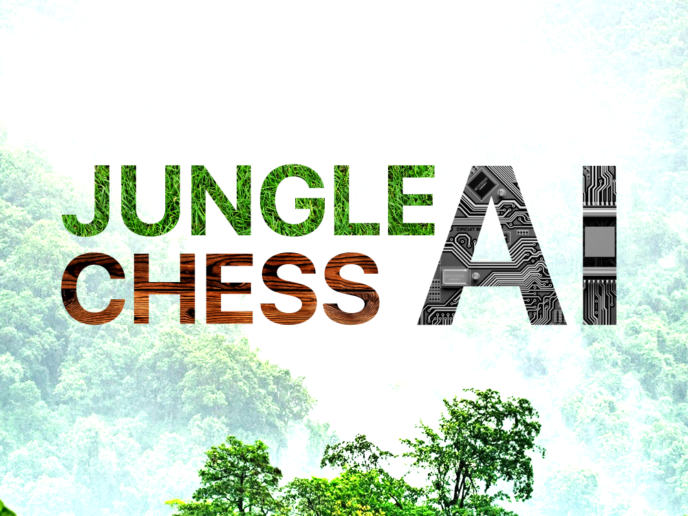

# Jungle Chess AI
  

Simple Jungle Chess AI using Minimax Alpha Beta Pruning algorithm on web-based platform made only using vanilla JS.

> 🥇 Winning AI in AI course 2019 - iSTTS

> 💪 Won against hardest difficulty AI in [Safari Chess](http://www.windigig.com/#game1) (Play Store/App Store)

## Background
Jungle Chess AI project is the final project in the Artificial Intelligence course. All students were assigned to make a good and competitive [Jungle Chess](https://en.wikipedia.org/wiki/Jungle_(board_game)) AI, and that AI will fight against each other. Students are allowed to use any algorithm.

My team decided to use the [Minimax Alpha Beta Pruning algorithm](https://en.wikipedia.org/wiki/Alpha%E2%80%93beta_pruning), one of many algorithms in Game Theory. This algorithm will calculate n-step ahead, evaluate every possible state in the game, and decides to choose the best option.

## How to Run
1. download / clone this project
2. start http server (e.g. [Live Server](https://github.com/ritwickdey/vscode-live-server) in [vscode](https://code.visualstudio.com/))
3. open **index.html** file